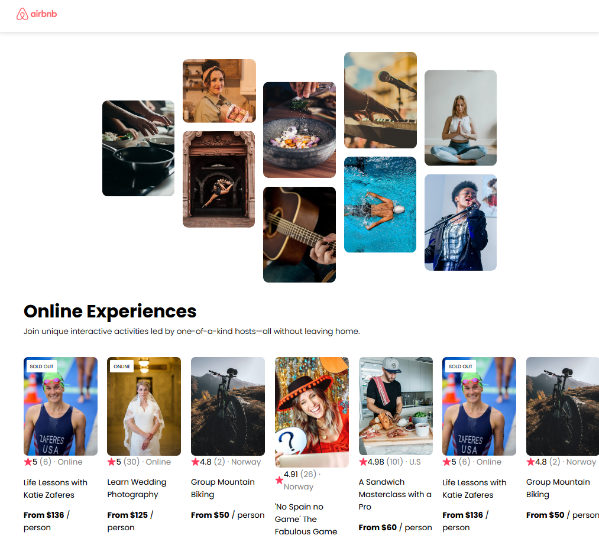

# Airbnb Clone App

This is an Airbnb clone app built using React. It aims to replicate the design of the homepage of the popular accommodation booking platform, Airbnb.


## Installation

To run this app locally, follow these steps:

1. Clone the repository:

```bash
git clone https://github.com/melbinkoshy/airbnb-clone.git
```
2. Install the dependencies
```
npm install
```
3. Run local server
```
npn run dev
```

Features to add:

1.Make the website responsive

P.S: this a very stripped down website that i made to practice react and design.Feel free to fork it and make your own changes<3.